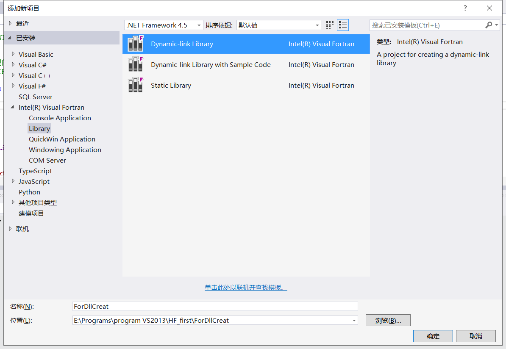
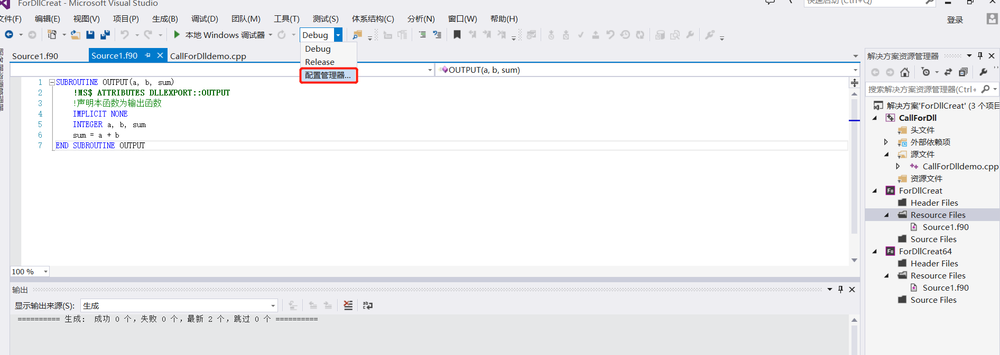
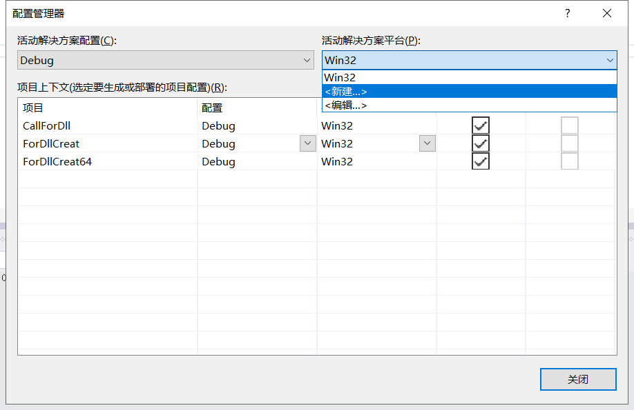
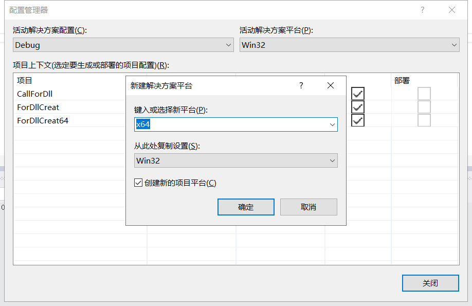
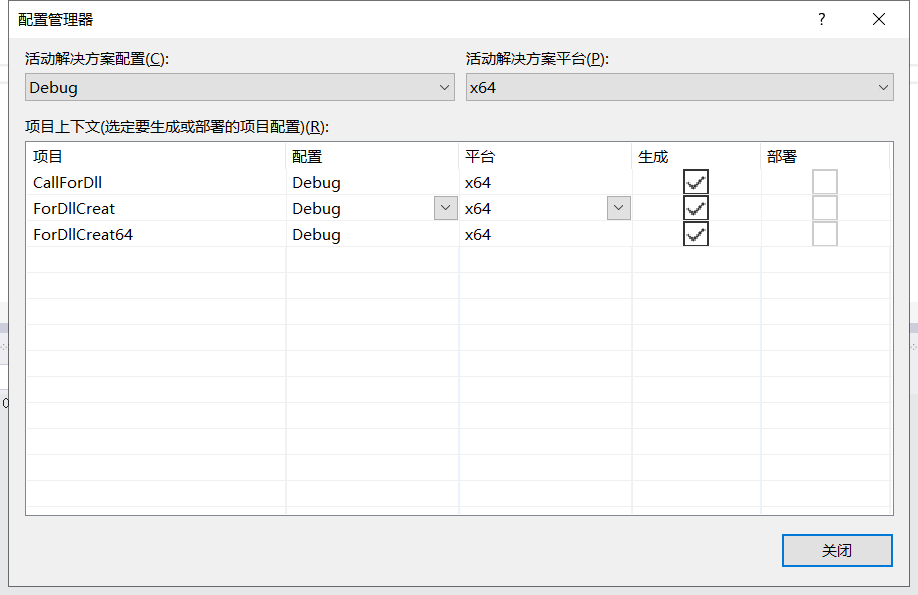
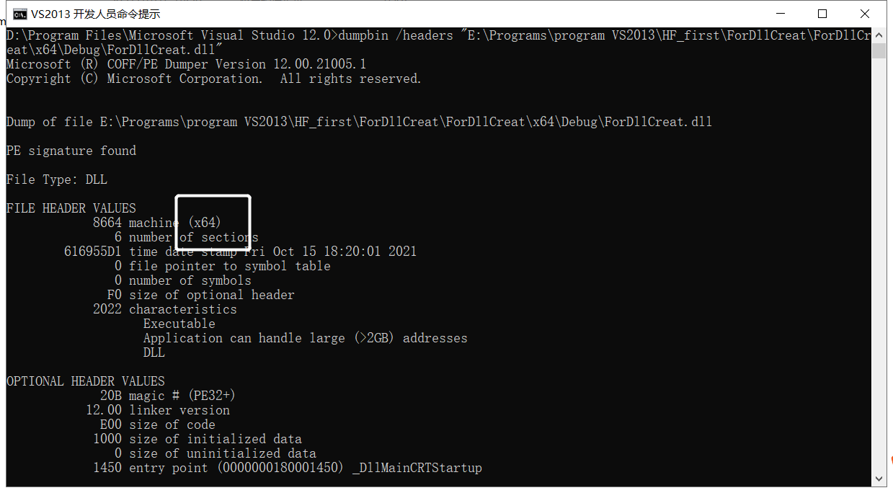

# 动态链接库(DLL)的生成与调用

2021年10月15日17:30:00 杨月宝

## 问题的产生与解决过程概述

热流问题数值计算课程的代码是2003年重新整理的Fortran代码。
我希望通过Julia调用教学代码中的函数完成课程大作业。
我用了三天才能成功通过Julia调用Fortran代码。

第一天，生成Fortran dll，尝试用C语言调用dll。

第二天，通过C++调用dll，尝试用Julia调用dll.

第三天，配置VS2013，生成64位dll，使用Julia(64bit)调用dll.

## 工作环境

Julia 1.7.0-beta2

VS2013 Fortran编译器：Intel.Visual.Fortran.Composer.XE.2013-SP1

VSCode

## 内容说明

1.使用Fortran生成dll

2.使用VS2013开发人员命令提示查看dll位数

3.使用C++调用dll

4.使用Julia调用dll

## 1.使用Fortran生成dll

新建一个Fortran动态链接库项目

### 

在Resource Files中添加一个f90文件，并输入如下内容

```Fortran
SUBROUTINE OUTPUT(a, b, sum)
    !MS$ ATTRIBUTES DLLEXPORT::OUTPUT
    !声明本函数为输出函数
    IMPLICIT NONE
    INTEGER a, b, sum
    sum = a + b
END SUBROUTINE OUTPUT
```

Fortran通过下句表示dll输出函数

```Fortran
!MS$ ATTRIBUTES DLLEXPORT::OUTPUT
```

配置编译器属性，选择64位的编译器来生成64位的dll

### 

### 

### 

### 

编译文件后生成项目，就可以在.\x64\Debug文件夹下找到生成的dll文件

## 使用VS2013开发人员命令提示查看dll位数

VS2013的工具路径在安装目录下

```txt
.\Microsoft Visual Studio 12.0\Common7\Tools\Shortcuts
```

选择VS2013开发人员命令提示，可以使用dumpbit命令获得dll信息

```txt
dumpbin /headers 路径
```

读取上段生成dll，部分结果：

### 

## 3.使用C++调用dll

这里采用动态调用方法，根据网上找到的资料和Fortran程序设计课程讲义，我重新整理了C++代码。

这部分代码把那几个冒号去了就是C的代码。

调试或启动exe文件前，请将dll文件放于EXE文件所在的Debug文件夹内。我的是在E:\Programs\program VS2013\HF_first\ForDllCreat\x64\Debug

我的解决方案名和Fortran生成dll的方案同名了，请不要混淆。

```C++
#include <stdio.h>
#include <windows.h> // 调用 WINDOWS API 函数所需的头文件

typedef void(*Func)(int *, int *, int *);//定义一个函数指针类型，这个指针类型与被调用函数的输入类型要一一对应

int main()
{
	int a = 1, b = 2, sum;

	//宏定义函数指针类型
	HMODULE hLibrary = ::LoadLibrary(L"ForDLLCreat.dll"); //加载动态库文件，dll名前不加L会报错
	if (hLibrary == NULL)
	{
		printf("No DLL file exist!\n");
		return -1;
	}
	Func dllPro = (Func)::GetProcAddress(hLibrary, "OUTPUT");
	//获得 Fortran 导出函数的地址
	if (dllPro == NULL)
	{
		printf("Can not fine the address of the function!\n");
		return -2;
	}
	dllPro(&a, &b, &sum);
	printf("%d + %d = %d\n", a, b, sum);
	FreeLibrary(hLibrary); //卸载动态库文件
	return 0;
}
```

## 4.使用Julia调用dll

此部分是最后一部分，也是最重要的一部分。我将在Jupyter的交互脚本中完成。

在开始前，请务必确认Julia的位数与所用dll位数相同，否则会报错dll不是一个可用的Win32应用。

```txt
ERROR: LoadError: could not load library "e:\yyb\HF_first\ForDllCreat.dll"
%1 is not a valid Win32 application.
Stacktrace:
 [1] top-level scope
   @ e:\yyb\HF_first\test.jl:15
in expression starting at e:\yyb\HF_first\test.jl:15
```
